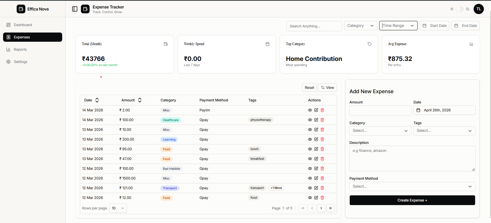

# Finance Management - Expense Tracker

> 💰 **A production-ready full-stack expense tracking application** demonstrating enterprise-grade architecture, clean code principles, and modern DevOps practices.

A comprehensive full-stack web application built with **ASP.NET Core**, **React 19**, **PostgreSQL**, and **Docker** for containerized deployment. This project showcases professional software engineering practices including Clean Architecture, CQRS pattern, rate limiting, comprehensive security measures, and cloud-native deployment strategies.

### ✨ Highlights

- **Clean Architecture** with separation of concerns and domain-driven design
- **CQRS Pattern** for scalable and maintainable business logic
- **Azure AD Integration** with JWT-based authentication
- **Rate Limiting** middleware for API protection
- **Health Checks & Monitoring** for production reliability
- **Docker & Kubernetes-ready** containerized setup
- **Modern Frontend** with React 19, TypeScript, and component-driven architecture

---

## 📋 Table of Contents

- [Overview](#overview)
- [Tech Stack](#tech-stack)
- [Architecture](#architecture)
- [Clean Architecture Pattern](#clean-architecture-pattern)
- [Project Structure](#project-structure)
- [Prerequisites](#prerequisites)
- [Setup & Installation](#setup--installation)
- [Running the Application](#running-the-application)
- [Key Features](#key-features)
- [API Features](#api-features)
- [Development](#development)
- [Deployment](#deployment)

---

## 🎯 Overview

The Finance Management application is an **enterprise-grade solution** for expense tracking and financial management. It demonstrates real-world application development with:

- **Scalable Backend** built on ASP.NET Core 8+ with Clean Architecture
- **Modern Frontend** using React 19, TypeScript, and component composition
- **Containerized Infrastructure** with Docker, Docker Compose, and Nginx
- **Enterprise Security** featuring Azure AD, JWT authentication, and rate limiting
- **Production-Ready Observability** with health checks, structured logging, and monitoring
- **CQRS Pattern** for optimized command and query separation
- **Comprehensive Error Handling** with custom exception mappers and validation

This project is ideal for portfolio demonstration, team collaboration, and deployment in production environments.

---

## � Screenshots

### Dashboard & Expense Management

The application provides an intuitive, modern UI for tracking and analyzing expenses:



**Key UI Features:**

- 📊 **Dashboard Overview** - Total monthly spend, weekly trends, top spending categories
- 🔍 **Advanced Search & Filtering** - Search by keyword, category, date range
- 💳 **Expense Management** - Create, edit, delete expenses with full details
- 🏷️ **Categories & Tags** - Organize expenses with custom categorization
- 📈 **Analytics** - Visual insights into spending patterns
- 🎨 **Responsive Design** - Works seamlessly on desktop, tablet, and mobile
- 🌓 **Dark/Light Mode** - Theme support for user preference

---

## �🛠 Tech Stack

### **Frontend**

- **Framework:** React 19 with TypeScript
- **Build Tool:** Vite (lightning-fast bundling)
- **Styling:** Tailwind CSS 4 with @tailwindcss/vite
- **UI Components:** Radix UI + shadcn (headless component library)
- **Form Management:** React Hook Form with Zod validation
- **State Management:** Zustand (lightweight alternative to Redux)
- **Data Fetching:** Axios + TanStack React Query (data fetching & caching)
- **Tables:** TanStack React Table (headless table library)
- **Authentication:** Azure MSAL (Microsoft Authentication Library)
- **Date Handling:** date-fns
- **Icons:** Lucide React
- **Toast Notifications:** Sonner

### **Backend** ⚙️

- **Framework:** ASP.NET Core 8+ (latest .NET runtime)
- **Architecture Pattern:** Clean Architecture with strict layer separation
- **Command Query Pattern:** CQRS (Command Query Responsibility Segregation)
- **Authentication & Authorization:**
  - JWT Bearer token validation
  - Azure AD integration via Microsoft Identity Web
  - Policy-based authorization
  - Secure token refresh mechanisms
- **Request Handling:**
  - Rate Limiting middleware (configurable thresholds)
  - CORS policy management
  - Exception handling middleware
  - Request/response logging
- **Data Validation:**
  - FluentValidation with CRUD operation validation
  - Custom validators for business rules
  - Automatic validation filtering on API layer
- **Database Access:**
  - Entity Framework Core ORM
  - Repository pattern for data abstraction
  - Query optimization and eager loading
  - Migration management
- **API Documentation & Exploration:**
  - Scalar (interactive OpenAPI documentation)
  - Detailed endpoint specifications
  - Example requests and responses
- **Dependency Management:**
  - Scrutor for automatic service registration
  - Constructor injection throughout
  - Singleton/Scoped/Transient lifecycle management
- **Observability:**
  - ASP.NET Core built-in health checks
  - PostgreSQL readiness probes
  - Structured logging preparation
  - Performance metrics ready

### **Database**

- **Database:** PostgreSQL (latest)
- **Container Image:** postgres:latest
- **Persistence:** Docker volume mounting for data persistence
- **Health Checks:** PostgreSQL readiness checks via `pg_isready`

### **Infrastructure & DevOps**

- **Containerization:** Docker with multi-stage builds
- **Orchestration:** Docker Compose
- **Reverse Proxy:** Nginx (port 80 & 443)
- **Environment Management:** .env file configuration
- **Service Health Checks:** Health endpoints for API and Database

### **Package Manager**

- **Frontend:** pnpm (faster, more efficient npm alternative)

---

## 🏗 Architecture

### System Architecture

The application implements a **three-tier containerized microservices-ready architecture**:

```
┌──────────────────────────────────────────────────────────────────┐
│                     NGINX Reverse Proxy                           │
│              (Port 80 & 443 - SSL Ready)                         │
│  - Request routing & load balancing                              │
│  - Static file serving & caching                                 │
└────────────┬───────────────────────────────────────┬─────────────┘
             │                                       │
   ┌─────────▼──────────┐              ┌────────────▼──────────┐
   │   React Frontend   │              │  ASP.NET Core API     │
   │  - SPA (Vite)      │              │  - REST Endpoints     │
   │  - Component-based │              │  - Business Logic     │
   │  - Type-safe (TS)  │              │  - Clean Architecture │
   └─────────┬──────────┘              └────────────┬──────────┘
             │                                     │
             │         ┌──────────────────────────┘
             │         │
    ┌────────▼─────────▼────────────┐
    │      PostgreSQL Database      │
    │  - Transactional consistency  │
    │  - ACID compliance            │
    │  - Connection pooling         │
    └───────────────────────────────┘
```

### Request Flow & Processing

1. **Client Request** → Nginx reverse proxy
2. **Routing**:
   - `/` → React frontend (static assets)
   - `/api/*` → ASP.NET Core API (REST endpoints)
3. **API Processing Pipeline**:
   ```
   HTTP Request
      ↓
   Authentication Middleware (JWT validation)
      ↓
   Rate Limiting Middleware (throttle enforcement)
      ↓
   CORS Middleware (origin validation)
      ↓
   Routing → Controller → Application Layer
      ↓
   Business Logic (CQRS)
      ↓
   Repository → Entity Framework → PostgreSQL
      ↓
   Response Serialization & Return
   ```
4. **Error Handling**: Custom middleware catches exceptions and returns appropriate HTTP status codes

---

## 📁 Project Structure

```
expense_tracker/
├── docker-compose.yml          # Container orchestration configuration
├── README.md                   # Project documentation
├── .env                        # Environment variables (not in repo)
│
├── client/                     # Frontend Application
│   ├── src/
│   │   ├── main.tsx           # Entry point
│   │   ├── index.css          # Global styles
│   │   ├── vite.config.ts     # Vite configuration
│   │   ├── app/               # Application layer
│   │   │   ├── providers/     # Context providers
│   │   │   └── store/         # Global state management
│   │   ├── features/
│   │   │   ├── auth/          # Authentication module
│   │   │   └── expense/       # Expense tracking module
│   │   ├── components/        # Reusable components
│   │   │   ├── common-drawer/ # Drawer component
│   │   │   ├── datatable/     # Data table
│   │   │   ├── form/          # Form components
│   │   │   ├── input/         # Input components
│   │   │   ├── select/        # Select dropdown
│   │   │   └── ui/            # Base UI components
│   │   ├── hooks/             # Custom React hooks
│   │   ├── layout/            # Layout components
│   │   ├── lib/               # Utilities
│   │   │   ├── errorMapper.ts # API error handling
│   │   │   ├── toast.ts       # Toast notifications
│   │   │   └── utils.ts       # Helper functions
│   │   ├── types/             # TypeScript interfaces
│   │   └── config/            # Configuration files
│   ├── package.json           # Dependencies
│   ├── pnpm-lock.yaml        # Dependency lock file
│   ├── Dockerfile            # Docker image build
│   ├── nginx.conf            # Nginx configuration
│   └── tsconfig.json         # TypeScript configuration
│
├── server/                     # Backend API
│   ├── API/                   # API Layer
│   │   ├── Program.cs         # Entry point & service configuration
│   │   ├── API.http           # HTTP request examples
│   │   ├── appsettings.json   # Configuration
│   │   ├── Controllers/       # API endpoints
│   │   ├── Middlewares/       # Custom middlewares
│   │   └── Extensions/        # Extension methods
│   │
│   ├── Application/           # Business Logic Layer
│   │   ├── Features/
│   │   │   ├── Expenses/      # Expense use cases (CQRS Commands/Queries)
│   │   │   └── Auth/          # Authentication logic
│   │   ├── Interfaces/        # Service contracts
│   │   ├── Common/            # Shared logic
│   │   └── Enums/             # Enumerations
│   │
│   ├── Domain/                # Domain Layer (Entities)
│   │   ├── Entity/            # Database entities
│   │   └── Enums/             # Domain enumerations
│   │
│   ├── InfraStructure/        # Data Access Layer
│   │   ├── Persistence/       # Database context & configurations
│   │   ├── Repository/        # Data repositories
│   │   └── Services/          # Infrastructure services
│   │
│   ├── Dockerfile            # Docker image build
│   └── FinanceManager.slnx   # Solution file
│
├── nginx/                      # Reverse Proxy Configuration
│   └── nginx.conf            # Nginx routing rules
│
└── db/                         # Database
    └── pgdata/                # PostgreSQL data volume
```

---

## 📋 Prerequisites

Before running the application, ensure you have:

- **Docker** (version 20.10+)
- **Docker Compose** (version 1.29+)
- **pnpm** (for development without Docker)
- **Node.js** 18+ (for development)
- **.NET SDK** 8+ (for server development)

---

## 🚀 Setup & Installation

### 1. **Clone the Repository**

```bash
git clone <repository-url>
cd expense_tracker
```

### 2. **Create Environment File**

Create a `.env` file in the root directory:

```env
# PostgreSQL Configuration
POSTGRES_USER=admin
POSTGRES_PASSWORD=your_secure_password
POSTGRES_DB=appdb

# API Configuration
ASPNETCORE_ENVIRONMENT=Production

# Azure AD Configuration (Optional)
AZURE_AD_CLIENT_ID=your_client_id
AZURE_AD_TENANT_ID=your_tenant_id
AZURE_AD_CLIENT_SECRET=your_client_secret
```

### 3. **Build Docker Images**

```bash
docker-compose build
```

---

## ▶️ Running the Application

### **Using Docker Compose (Recommended)**

```bash
# Start all services
docker-compose up -d

# View logs
docker-compose logs -f

# Stop services
docker-compose down

# Stop and remove volumes
docker-compose down -v
```

**Service URLs:**

- **Frontend:** http://localhost (Nginx proxy)
- **API:** http://localhost:5000 (or http://api:8080 internally)
- **Database:** localhost:5432

### **Local Development**

#### **Frontend**

```bash
cd client
pnpm install
pnpm run dev
```

Runs on http://localhost:5173 with HMR (Hot Module Replacement)

#### **Backend**

```bash
cd server/API
dotnet restore
dotnet run
```

Runs on http://localhost:5000

---

## ✨ Key Features

### **Authentication & Authorization**

- Azure AD integration via MSAL
- JWT token-based authentication
- Secure API endpoints with authorization policies

### **Expense Management**

- Create, read, update, delete expenses
- Categorize and filter expenses
- Real-time data synchronization with React Query

### **User Interface**

- Responsive design (mobile-first approach)
- Dark/light theme support via Radix UI
- Data tables with sorting and filtering (TanStack React Table)
- Form validation with Zod schemas
- Toast notifications for user feedback

### **Performance**

- Vite for fast development builds
- React Query for intelligent data caching
- Lazy loading of components
- Nginx reverse proxy caching

### **Monitoring & Reliability**

- Health checks for API and Database
- Container restart policies
- Service dependencies management
- Structured logging

---

## 🔧 Development

### **Frontend Development**

#### Available npm Scripts

```bash
pnpm run dev       # Start dev server with HMR on :5173
pnpm run build     # Optimize & bundle for production
pnpm run lint      # ESLint analysis
pnpm run preview   # Preview production build locally
pnpm run gen       # Generate feature boilerplate
```

#### Feature Generation

Scaffold new features with predefined structure:

```bash
pnpm run gen
# Generates:
# - Feature folder with components
# - Hooks for data fetching
# - Types and interfaces
# - Store slices (Zustand)
```

#### Code Organization

**Domain-driven Structure:**

```
src/features/
├── auth/          # Authentication domain
│   ├── components/
│   ├── hooks/
│   ├── services/
│   └── types.ts
└── expense/       # Expense domain
    ├── components/
    ├── hooks/
    ├── services/
    └── types.ts
```

**Shared Resources:**

- `/components` - Reusable UI components (Radix UI + shadcn)
- `/hooks` - Custom React hooks
- `/lib` - Utilities, error mappers, toast service
- `/types` - TypeScript interfaces

#### API Communication Pattern

```typescript
// 1. Data Fetching with React Query
const { data, isLoading, error } = useQuery({
  queryKey: ["expenses", userId],
  queryFn: () => api.getExpenses(userId),
});

// 2. HTTP Requests via Axios
const api = axios.create({
  baseURL: "/api",
  headers: { Authorization: `Bearer ${token}` },
});

// 3. Error Handling
api.interceptors.response.use(
  (res) => res,
  (error) => handleError(error), // Map to user-friendly messages
);

// 4. Centralized Error Mapping (errorMapper.ts)
const message = getErrorMessage(error);
toast.error(message);
```

### **Backend Development**

#### Project Structure

**Clean Architecture Layers:**

```csharp
// 1. API Layer (Controllers)
[Route("api/[controller]")]
public class ExpenseController : ControllerBase
{
    public async Task<ActionResult<ExpenseDto>> Create(
        CreateExpenseCommand command) { ... }
}

// 2. Application Layer (CQRS)
public record CreateExpenseCommand { ... }
public class CreateExpenseHandler
    : ICommandHandler<CreateExpenseCommand, ExpenseDto> { ... }

// 3. Domain Layer (Entities)
public class Expense : BaseEntity
{
    public string Description { get; set; }
    public decimal Amount { get; set; }
    // Business logic & invariants
}

// 4. Infrastructure Layer (Repositories)
public class ExpenseRepository : IExpenseRepository
{
    private readonly AppDbContext _context;
    // Data access implementation
}
```

#### Middleware Pipeline

```csharp
// Program.cs configuration order matters
app.UseHttpsRedirection();
app.UseCors();
app.UseAuthentication();      // JWT validation
app.UseRateLimiting();        // Rate limiting
app.UseAuthorization();       // Policy enforcement
app.MapControllers();
```

---

## 🏛️ Clean Architecture Pattern

The backend follows **Uncle Bob's Clean Architecture** principles ensuring maintainability, testability, and scalability:

### Layer Overview

```
    ┌─────────────────────────────────────────┐
    │         API Layer (Controllers)         │
    │  - HTTP request handling                │
    │  - DTO mapping & serialization          │
    │  - Route definition                     │
    └─────────────────────┬───────────────────┘
                          │ depends on
    ┌─────────────────────▼───────────────────┐
    │   Application Layer (Business Logic)    │
    │  - CQRS Commands & Queries              │
    │  - Use case orchestration               │
    │  - Service interfaces (contracts)       │
    │  - Application services                 │
    └─────────────────────┬───────────────────┘
                          │ depends on
    ┌─────────────────────▼───────────────────┐
    │      Domain Layer (Business Rules)      │
    │  - Entities & aggregates                │
    │  - Domain value objects                 │
    │  - Business logic & invariants          │
    │  - Domain services                      │
    └─────────────────────┬───────────────────┘
                          │ depends on
    ┌─────────────────────▼───────────────────┐
    │   Infrastructure Layer (Data Access)    │
    │  - Database context (EF Core)           │
    │  - Repository implementation            │
    │  - External service integrations        │
    │  - Authentication providers             │
    └─────────────────────────────────────────┘
```

### Key Architecture Principles

#### 1. **Dependency Inversion**

- Abstractions over concrete implementations
- Interfaces define contracts
- High-level modules don't depend on low-level modules

```csharp
// Example: Service interface (Application layer)
public interface IExpenseService {
    Task<ExpenseDto> CreateAsync(CreateExpenseCommand command);
    Task<ExpenseDto> GetByIdAsync(int id);
}

// Implementation (Infrastructure layer)
public class ExpenseService : IExpenseService { ... }
```

#### 2. **CQRS Pattern (Command Query Responsibility Segregation)**

- **Commands**: State-changing operations (Create, Update, Delete)
- **Queries**: Read-only data retrieval
- Separated concerns allow independent optimization

```csharp
// Command: Modifies state
public record CreateExpenseCommand(
    string Description,
    decimal Amount,
    int CategoryId,
    DateTime Date
);

// Query: Retrieves data
public record GetExpensesQuery(
    int UserId,
    int? CategoryId = null,
    DateTime? StartDate = null
);
```

#### 3. **Separation of Concerns**

- Each layer has single responsibility
- Minimal cross-layer dependencies
- Clear boundaries and interfaces
- Easy to test and modify

#### 4. **Entity Framework Core Integration**

- DbContext in Infrastructure layer
- Repository pattern abstracts data access
- Migrations for schema versioning
- Query optimization at data layer

### Folder Structure

```
server/
├── API/                          # Presentation Layer
│   ├── Controllers/              # HTTP endpoints
│   ├── Middlewares/              # Rate limiting, auth, CORS
│   ├── Extensions/               # DI configuration
│   └── Program.cs                # App startup
│
├── Application/                  # Business Logic Layer
│   ├── Features/
│   │   ├── Expenses/
│   │   │   ├── Commands/         # Create, Update, Delete
│   │   │   ├── Queries/          # Read operations
│   │   │   └── Handlers/         # CQRS handlers
│   │   └── Auth/
│   ├── Interfaces/               # Service contracts
│   ├── DTOs/                     # Data transfer objects
│   └── Services/                 # Application services
│
├── Domain/                       # Business Rules Layer
│   ├── Entity/                   # Domain entities
│   ├── Enums/                    # Domain enumerations
│   └── ValueObjects/             # Immutable value objects
│
└── Infrastructure/               # Data Access Layer
    ├── Persistence/
    │   ├── AppDbContext.cs       # EF Core context
    │   └── Configurations/       # Entity mappings
    ├── Repository/               # Data repositories
    └── Services/                 # External services (Auth, Email, etc.)
```

### 3. **API Layer - Controllers**

- Handles HTTP requests/responses
- DTO mapping and validation
- Route configuration
- Status code management

### 2. **Application Layer - Business Logic**

- CQRS command/query handlers
- Use case orchestration
- Cross-cutting concerns (validation, logging)
- Application services

### 1. **Domain Layer - Business Rules**

- Core business entities
- Domain value objects
- Business logic and invariants
- Domain services

### 0. **Infrastructure Layer - Data Access**

- Database context (Entity Framework Core)
- Repository pattern implementation
- External service integrations
- Authentication providers

---

## 📊 Database Schema (PostgreSQL)

The application uses PostgreSQL with Entity Framework Core for data access. Key entities include:

- **Users** - Azure AD integrated user profiles
- **Expenses** - Expense records with categories, amounts, dates
- **Categories** - Expense categories

---

## � Security & Rate Limiting

### Authentication & Authorization

✅ **Multi-layered Security:**

- **Azure AD Integration** - Enterprise-grade identity provider
- **JWT Token Validation** - Secure stateless authentication
- **Refresh Token Rotation** - Enhanced token lifecycle management
- **Policy-based Authorization** - Fine-grained access control
- **Bearer Token Scheme** - Standard HTTP authorization

### Rate Limiting Middleware

Implements throttling to protect API from abuse and ensure fair resource usage:

```csharp
// Rate Limiting Configuration
- Default: 100 requests per minute per user
- Premium: 1000 requests per minute per user
- Anonymous: 20 requests per minute per IP

// Middleware Stack (api/Middlewares/RateLimitingMiddleware.cs)
- Tracks requests by UserId or IP address
- Uses in-memory cache with sliding window
- Returns HTTP 429 (Too Many Requests) when exceeded
- Includes retry-after headers
```

**Rate Limiting Features:**

- ✅ Per-user rate limiting (authenticated requests)
- ✅ Per-IP rate limiting (anonymous requests)
- ✅ Configurable thresholds by user tier
- ✅ Sliding window algorithm for fair distribution
- ✅ Retry-After header guidance
- ✅ Whitelist support for internal services

### Additional Security Measures

✅ **Implemented:**

- CORS policy with allowed origins
- HTTPS/TLS ready (Nginx SSL support)
- Input validation (FluentValidation)
- SQL injection prevention (EF Core parameterized queries)
- Environment-based configuration (sensitive data not in code)
- Health check authentication
- Request logging and audit trails

✅ **Recommended for Production:**

- Enable SSL/TLS certificates (Let's Encrypt)
- API Gateway with WAF (Web Application Firewall)
- Database encryption at rest
- Secrets management (Azure Key Vault)
- Regular security audits and penetration testing
- Dependency vulnerability scanning
- DDoS protection (Cloudflare, AWS Shield)

---

## 📞 Support & Troubleshooting

### **Docker Issues**

```bash
# Clean up containers and volumes
docker-compose down -v

# Rebuild images
docker-compose build --no-cache

# View service logs
docker-compose logs service_name
```

### **Health Checks**

- API Health: `http://localhost:5000/health/ready`
- Database Health: Checked automatically by Docker Compose

---

## � Deployment

### Docker Deployment

```bash
# Build all images
docker-compose build

# Run in production mode
docker-compose -f docker-compose.yml up -d

# Monitor health
docker-compose ps

# View logs
docker-compose logs -f api
```

### Production Checklist

- [ ] Environment variables configured
- [ ] SSL/TLS certificates installed
- [ ] Database backups configured
- [ ] Monitoring & alerting setup
- [ ] Rate limiting thresholds tuned
- [ ] CORS origins whitelisted
- [ ] Azure AD credentials verified
- [ ] Secrets stored securely (not in code)

---

## 📚 Learning & Resources

### Architecture Patterns

- [Clean Architecture](https://blog.cleancoder.com/uncle-bob/2012/08/13/the-clean-architecture.html) - Uncle Bob's principles
- [CQRS Pattern](https://martinfowler.com/bliki/CQRS.html) - Command Query Responsibility Segregation
- [Repository Pattern](https://martinfowler.com/eaaCatalog/repository.html) - Data abstraction

### Technologies Used

- [ASP.NET Core Docs](https://docs.microsoft.com/en-us/aspnet/core/)
- [Entity Framework Core](https://docs.microsoft.com/en-us/ef/core/)
- [React 19 Documentation](https://react.dev)
- [Docker Best Practices](https://docs.docker.com/develop/dev-best-practices/)

---

## 👨‍💻 Author

Built with ❤️ using modern web technologies and enterprise architecture best practices.

**Technologies:** ASP.NET Core • React • TypeScript • PostgreSQL • Docker • Clean Architecture • CQRS

**Key Concepts:** Microservices-ready • Cloud-native • Rate Limiting • JWT Authentication • Clean Code • Best Practices
